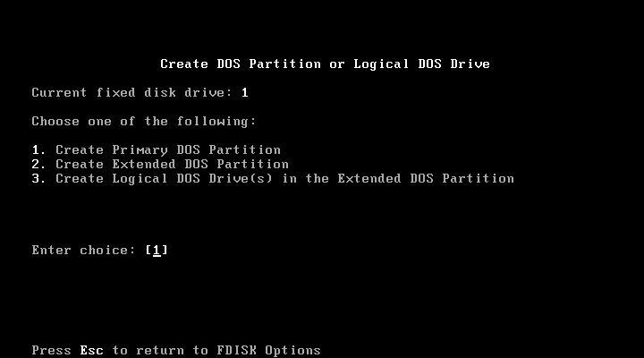
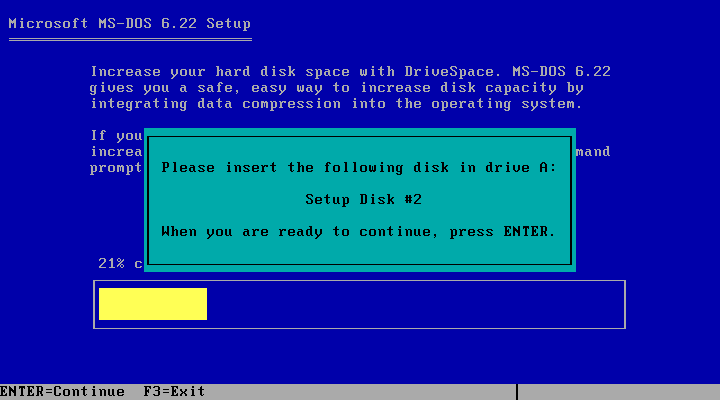
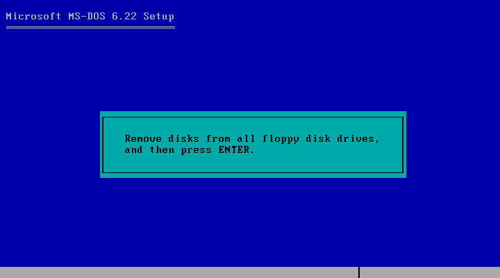

# Instalando MS-DOS 6.22

## Preparando o disco rígido
Após criar a máquina virtual no VirtualBox (processo bem simples), inicializar a VM com o disco de boot do MS-DOS 6.22 e executar o comando a:\fdisk. A seguinte tela será exibida.

Selecione a opção 1 para criar a(s) partição(ões) DOS.

Selecione a opção 1 para criar a partição primária. Será solicitado se todo o espaço do disco deve ser utilizado para a partição primária. Essa pergunta é feita porque se precisarmos dividir o disco rígido em duas ou mais partes, deve-se responder **não**. A criação de partições estendidas esta fora do escopo deste documento.

Confirmar que é para utilizar todo o espaço em disco para a partição primária. Uma mensagem informando que o sistema será reiniciado será exibida.

Após reiniciar o sistema, a instalação do Ms-Dos 6.22 poderá ser efetuada.

## Instalando o MS-DOS 6.22

Inicializar a máquina virtual com o disco de instalação #1. A tela de boas-vindas do instalador do MS-DOS 6.22 será apresentada.

Pressionando a tecla Enter, a tela para configurar os itens do sistema é apresentada.

Após configurar os itens do sistema e pressionar a tecla Enter, é apresentada a tela para definir o local onde o MS-DOS 6.22 será instalado.

Após definir o local, o MS-DOS 6.22 será instalado e o disco de instalação #2 será solicitado.

Após o término da instalação do disco #2, o disco de instalação #3 será solicitado.

Após todo o MS-DOS 6.22 ser instalado, deve-se retirar os discos e pressionar a tecla Enter.

Uma mensagem informando que o Ms-Dos 6.22 esta instalado é exibida.

## Acessando o MS-DOS 6.22
Após reiniciar a máquina virtual, será apresentada a linha de comando do MS-DOS.

Na linha de comando, digitar o comando c:\help para ter acesso ao guia de referência dos comandos do MS-DOS.

**Pronto!!!** O MS-DOS 6.22 esta funcionando no VirtualBox.

