# Aplicativos MS-DOS 6.22

## Banner Mania
Programa para criar banners e posters lançado em 1989. Normalmente os banners eram impressos em impressoras matriciais.

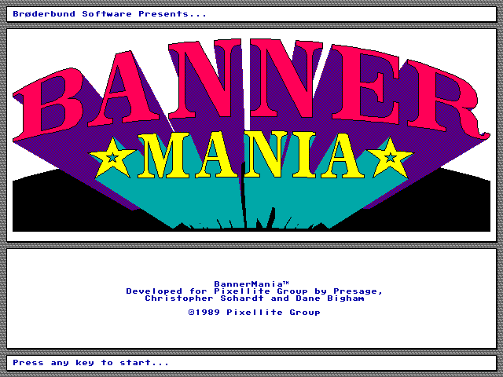
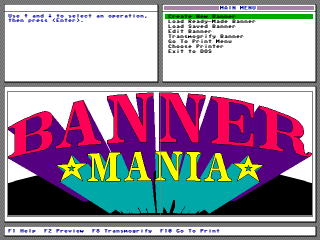

## Fanta Vision
Originalmente escrito para o Apple II, Fanta Vision era um programa para criar animações. Em 1988 foi lançado para MS-DOS.

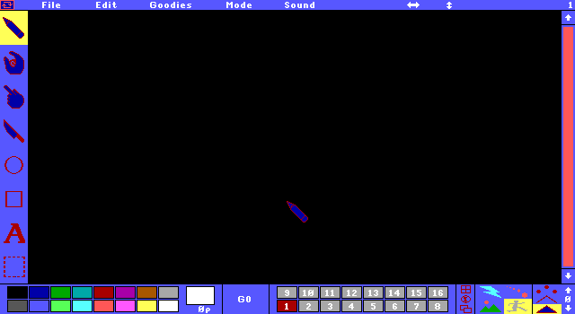

## HelpPC
Programa que reunia referências sobre a linguagem Assembler, linguagem C, especificações sobre hardware, interrupções do MS-DOS, tabelas e formatos utilizados pelo DOS e pela BIOS e tópicos diversos.

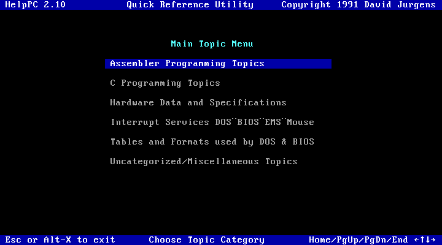

## Lotus 123
Lançado em 1983, o Lotus 123 era um programa para criar planilhas eletrônicas.

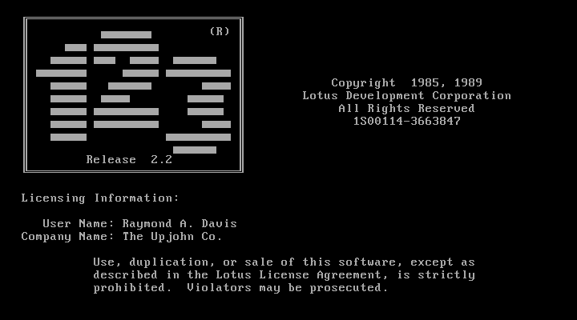
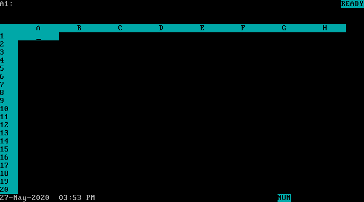

## Norton Commander
Também conhecido por nc, lançado em 1986, era um programa para criar, apagar, renomear, mover e copiar arquivos e diretórios através de uma interface gŕáfica baseada em caracteres.

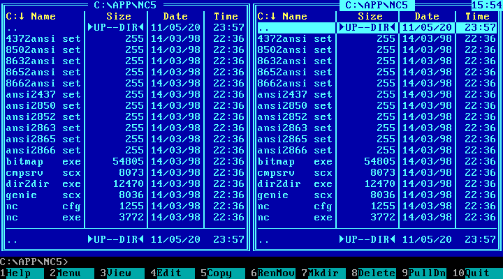
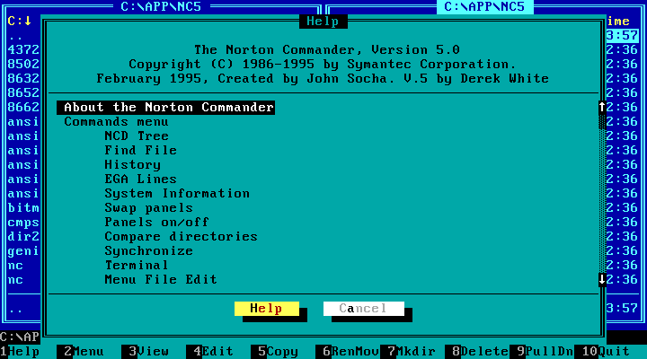

## Newsmaster
Programa para criar boletins informativos.

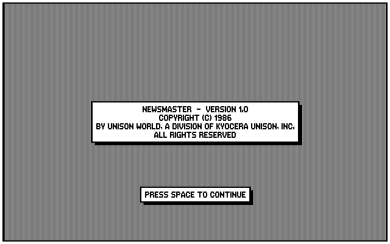
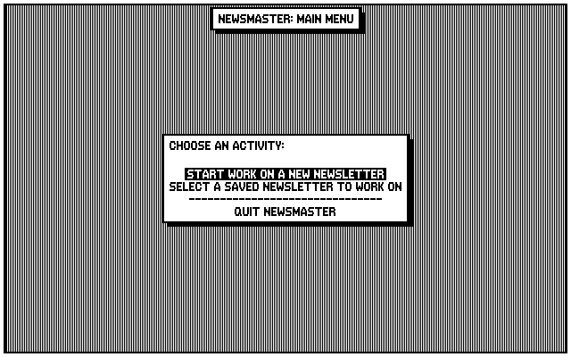

## Norton Guide
Coleção de programas residentes em memória (TSR) que ofereciam um guia de referência para as linguagens Assembly x86, C, Basic e Fortran.

Como o programa ficava residente em memória, bastava pressionar as teclas SHIFT+F1 e digitar alguma letra que o programa entrava em ação exibindo o tópico referente a tecla pressionada.

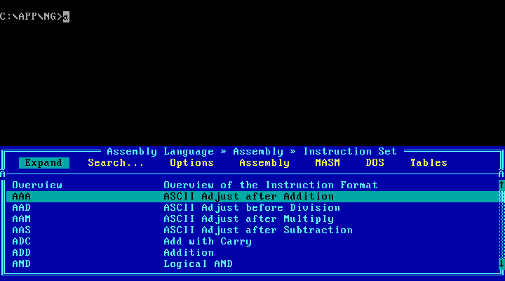
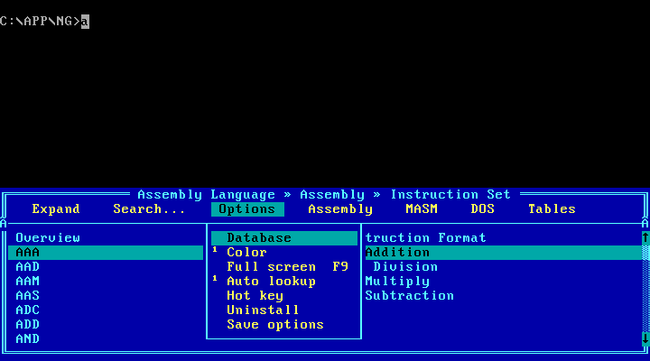
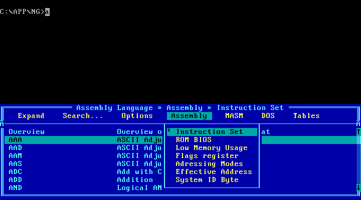
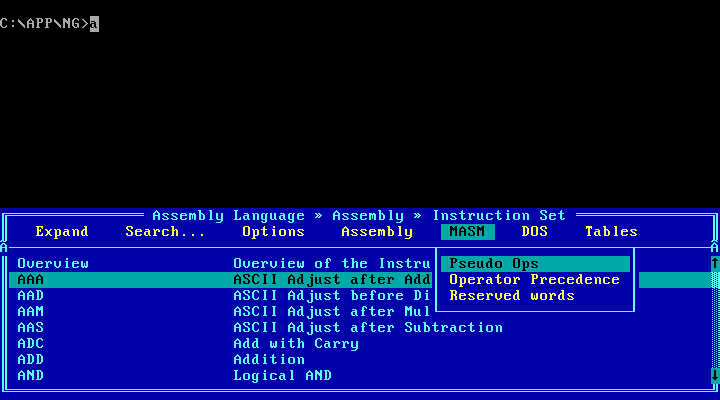
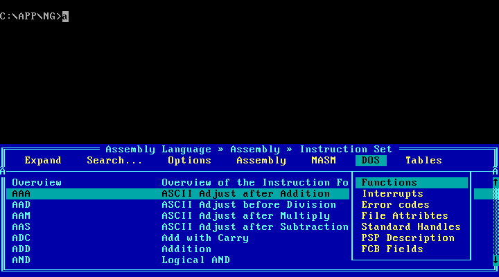
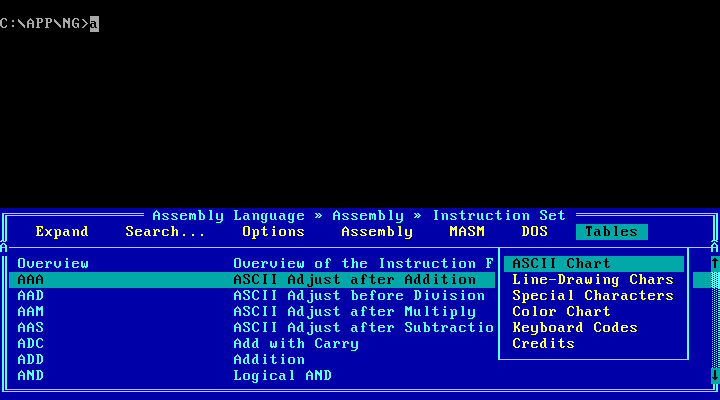

## Printmaster
Lançado em 1985, era um programa para criar cartões e banners.

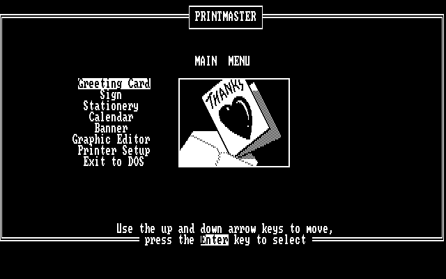

## Word
Programa para criar documentos textuais.

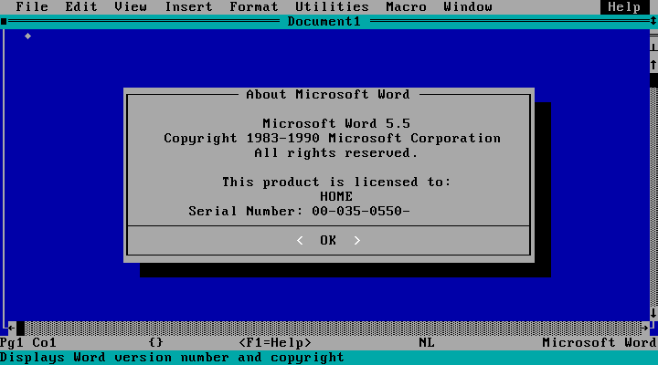

## Wordstar
Lançado em 1978, era um programa para criar documentos textuais.

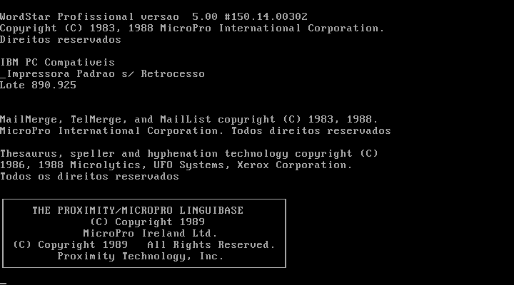
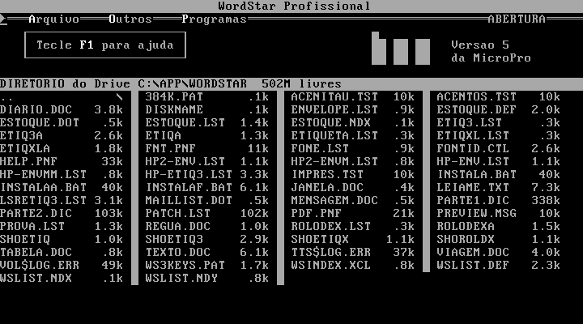

