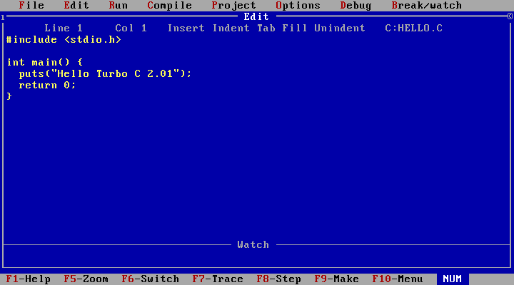
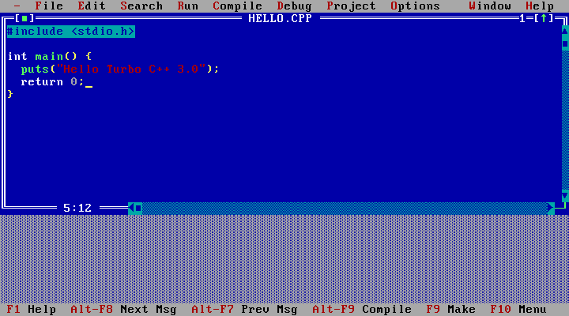

# Linguagens de programação MS-DOS 6.22

## Clipper
Criado pela Nantucket Corporation em 1984 e depois adquirido pela Computer Associates em 1992, o Clipper era um compilador xBase que implementava uma variante da linguagem de programação xBase. Era utilizado para criar programas para MS-DOS.

## Dbase III Plus
Lançado em 1979, o Dbase era um sistema para gerenciamento de banco de dados.

## Turbo C
Lançado em 1987 pela Borland, o Turbo C era uma IDE (Integrated Development Environment) para criar programas usando a Linguagem C.

## Turbo C++
Lançado em 1990 pela Borland, o Turbo C++ era uma IDE (Integrated Development Environment) para criar programas usando a Linguagem C++.

## Turbo Pascal
Lançado em 1983 pela Borland, o Turbo Pascal era uma IDE (Integrated Development Environment) para criar programas usando a Linguagem Pascal.

